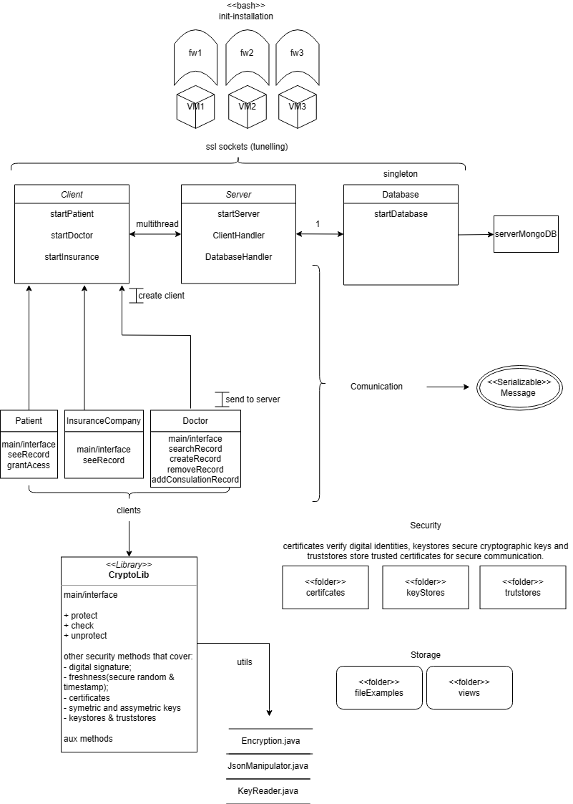

# A41 MediTrack Project Report

## 1. Introduction

We were challenged to implement a securely sound application, considering a given business scenario. In our case, the scenario was MediTrack: an electronic health records management system, used by medical institutions to securely store and manage patient data across several medical areas and institutions. The main points in the scenario were to guarantee confidentiality and authenticity, which in the system's perspective should involve the assurance of confidentiality of the patient's data, so that only authorized personnel should access critical information, as well as the proper authentication of changes to the records, guaranteeing that, for example, consultation records were added by the intended people. 

The secure document format was planned with all of this in mind, by offering for the same record several distinct views, a private (for the patient), a public (for other users), an authorized and an emergency view. Furthermore, (in the public view) the document was analyzed and divided by us into logical sections, which allowed for a selective encryption of specific fields in distinct ways, to make room for several different use cases, such as specialization or financially relevant information, each with their specifications.

The project infrastructure was a simple client->API->database architecture, in our case supporting various types of
clients: patients, doctors (of many specializations) and insurance companies. We did have a problem implementing the
database in our system and, as such, needed to resort to simply storing the files locally. However, from a system
perspective, the illusion of a database is maintained and the core security pillars are kept.

In relation to the security challenge, the main aspects required by it were already being implemented by us as a
part of the original concept solution. Implementing digital signatures per consultation record was easy because of
the scenario's baseline of sharing public keys; implementing the emergency view was also simple because we already 
had the medical specialization keys as a part of our concept; and the key distribution inherent to the access 
granted by the patient was also made easy thanks to the scenario baseline of sharing public keys.

Below is the schema of our system's organization (note that the featured database is the ideal system, not the real
one due to implementation complications).

## 2. Project Development

### 2.1. Secure Document Format

#### 2.1.1. Design

The most notorious part of our cryptographic solution is divided into two main aspects: document views and document sections. The reason for such great division is to accomodate for all types of users and situations we picked to
implement. The users capable of using this application are:
- Patients, that should have complete access to their record;
- Doctors, who can manipulate records, but can only see consult information from their own specialization, unless some specific situations (authorization or emergency speciality) occur;
- Insurance companies, that should only have access to financially related information;

To incorporate all of the desired functionality for all different types of users we decided that, for each patient record, there would be three different files that showed different views of the document. 
- The first one is the "private" view, that only the patient has access to. None of the other users can decrypt this file, and all the information is available to the patient.
- The second one is the "public" view, which is presented to the other users (doctors and insurance companies).
- The third one is the "emergency" view, which can be accessed by doctors of the emergency speciality, in which case
  the whole record is revealed.

Furthermore, the "public" view is divided into sections, to accomodate for different scenarios:
- Personal information, that is always hidden to the public;
- Urgent information, that is only revealed to authorized users;
- Consults information, that is revealed to doctors of the same speciality;
- Financial information, that is only revealed to the insurance company;

This design offers a lot of flexibility and ensures each participant can access their respective information,
without bloating too much the system with too many repeated views, while also being logically simple and 
straightforward.

Furthermore, our cyptographic library was implemented in a way that makes it as detached as possible from the
application logic. As such, various changes can be made to the application without requiring change in the library,
and each user needs only to call the library's functions in their own prefered way.

#### 2.1.2. Implementation

The library (as well as all the code) was implemented in Java and, as such, most cryptographic functions were
taken from Java's packages, like javax.crypto and java.security. The assymetric cyphering was made through the
RSA algorithm, the symmetric through AES. The specific cypher used wasn't our greatest priority, specially when it
compares to the different views and sections, but we did choose this base standards as the conditions didn't particularly call for more advanced methods, like CBC block cypher mode, as each element to be cyphered was likely
a small string. 

The library also offers availability and integrity mechanisms. Taking advantage of the already existing
private/public keys, a digital signature related to the entire document constitutes both authenticity and integrity
guarantees. Availability is achieved to a combination of a random generated nonce and a timestamp. The timestamp
ensures dropping of older messages, while the nonce works to avoid replay attacks.

The keys used were generated with the command line tool keytool, useful for assymetric, symmetric and
certificate generation. Both the keys already shared in the begining of the program and the other generated during
runtime use this command. These keys are attributed to each user in the way described next:
- Patient: has personal assymetric key pair, with public shared with the server. This is used to cypher the personal view, as well as the personal and urgent information sections of the public view;
- Doctor: has personal assymetric key pair, with public shared with the server;
- Insurance Company: has personal assymetric key pair, with public shared with the server. This is used to cypher financial information in the public view;
- Database: has personal assymetric key pair, with public shared with the server. Used for autheticating communications;
- Server: has personal assymetric key pair, with public shared with other users, to authenticate communications. Also posesses all speciality keys, as it is responsible for cyphering, propagating changes to all views, and delegating emergency or authenticated information to users, that these ones should not access at will.

The main challenge of this section was not necessarily in the implementation, but mostly on the design, specially 
with so many moving parts and requirements. Because of our requirements, the server ended up having to own the emergency key (in order to propagate the changes to that view) as it would become dangerous to hand such a powerfull
key to other users (the same thing goes for the rest of the speciality keys). As such, every consult requiring these
types of information always resorts to generating and handing session keys, action that becomes trivial thanks to the
share of public keys between users, which garantees the decyphering of the session key only by the intended individual.

### 2.2. Infrastructure

#### 2.2.1. Network and Machine Setup

Practical setup of machines and networks can be seen in the README.md file.

##### 2.2.1.1 Network Infrastructure

 - VM1 (connected to sw-1):
    IP address on interface eth0: 192.168.0.100/24
 - VM2 (connected to sw-1, sw-2, and the internet):
    IP address on interface eth0: 192.168.0.10/24
    IP address on interface eth1: 192.168.1.254/24
    IP address on interface eth2: (Connected to the Internet, not specified)
 - VM3 (connected to sw-2):
    IP address on interface eth0: 192.168.1.1/24

##### 2.2.1.2 Choice of Technologies

  All machines use Java 17.0.6 and Maven 3.8.1, but the VM3 also should use any functional MongoDB version. However, it was not possible to install any version due to unknown problems.
  We followed this official MongoDB tutorial https://www.mongodb.com/docs/manual/tutorial/install-mongodb-enterprise-on-debian/ but it did not work. We also asked for help from the teachers but no one could give us an answer to fix the problem. Therefore, we did not implement a local Mongo Database but stored the files locally.
  We have also tried to make a connection to the remote MongoDB, but it would throw out an error of certificates. Once more, the teacher said the only solution was the run the database locally. While we did not have the time to
implement a diferent database system, we made it so that the files would be stored locally at the database machine,
so that the illusion of database could be kept to the rest of the system.

#### 2.2.2. Server Communication Security

All three machines are connected through SSL/TLS connections. To make this connection possible, each machine has its keystore (with private key and certificate) and truststore (with the trusted entities certificates). These keys and certificates were created on the command line using Java Key Tool because our scenario assumed the previous creation of asymmetric keys
- The client truststore has the server certificate
- The server truststore has the client and database certificate
- The database truststore has the server certificate
  
To make the communication even more secure, we implemented a firewall for each machine that can be found in the `init-vm`{number}`.sh` file.
Each firewall restricts all channels to DROP and only opens communications to the IP's and PORTS that each machine is supposed to communicate to. The VM2 also has access to the internet.

To secure the integrity and authenticity of the messages sent between servers, each message (and record) was previously digitally signed with the private key of the sender. The receiver would then check the validity.
Each receiver could check this because each machine has access to all the necessary public keys of other clients/servers. As such, a basic mean of authentication can be sustained in every command, not just regarding
the secure document.

Also related to this topic of already existing public/private keys, comes the matter of key distribution. Key distribution is not required with these keys, but our application still uses session keys to achieve certain goals
(avoidance of sharing powerful speciality keys and allowing the possibility of access control). Key distribution is
made simple by this fact: since public keys are shared as a baseline (and, thus, trusted), the new session key can be
cyphered with the receiver's public key, to ensure only he can truly access it. This way, distribution of keys is made in a simple and straightforward way in our system.

### 2.3. Security Challenge

#### 2.3.1. Challenge Overview

Our design was not very much impacted by the challenge because we coincidently anticipated the scenario in 
the design phase. The following are the requested changes:
- Digital signatures of the doctor in every consult record, to ensure authentication;
- Emergency full access, to ensure that emergency doctors, under dire circumstances, could see the entire record
  of the patient;
- Patient access control, to allow other system users to see previously private information, under strict
  authorization of the patient;

#### 2.3.2. Attacker Model

In our scenario, this aspect wasn't made particularly apparent. Furthermore, the baseline of sharing public keys,
makes the evaluation of trusted/untrusted non intuitive, as the trust in having this system of keys already in play
wouldn't make sense had certain participants not be trusted. However, we tried to make the entire application as
sound as it could be, as well as not giving too much power to normal users (like the speciality keys). Indeed the
most powerfull element in the system is specifically the server, followed by the patient, with doctors and outside
participants such as insurance companies with very limited and controlled accesses and authentication checks.
Besides, while the patient is the user with the greatest access to information, it is also one that cannot alter
the records at all, further distributing possible vulnerabilities among other nodes of the system.

#### 2.3.3. Solution Design and Implementation

The solution design and implementation for each security requirement is as followed:
- Digital signatures of the doctor in every consultation record: since private/public keys were already in play from
  the get go, this requirement was as easy as it could be. The doctor, at the creation of the consult record,
  digitally signs the information introduced, and cyphers the contents of the rest of the fields. When any user with
  capability to read these fields receives the record, a check for authentication is made to ensure proper
  authentication on all consultation records.
- Emergency full access: since we were already working with speciality keys and diferent views, this was also simple.
  A new view (emergency view) was added, that was completly cyphered with the emergency key. Since the key was so
  powerful, we decided that the access to these view should be done through session keys. So when an authenticated
  emergency doctor sends a request for these view, the file is decrypted, a new session key is generated and
  the document cyphered with it. The key distribution then works as explained above.
- Patient access control: this was the only one a bit different, but the way we made it work is similar to
  the emergency scenario. When an authorized individual requests this view, the server adds and cyphers the new
  information with a new session key, that then is distributed to the receiver the way already explained.

  

  

## 3. Conclusion

With this project we strived to achieve a securely sound and simultaneous realistically functional application, that
could guarantee the proper handling of user data, across diferent machines and user inputs. We are confident that
the design choices we made reflect the system requirements well, as well as the different challenges suggested by
it. As with the scenario requirements:
- Confidentiality is achieved by only allowing the right information to reach the right individuals, whether through
  the views, the document sections, or through the encryption model, very dependent on the previously handed keys,
  which are deemed safe.
- Authenticity is achieved, whether by the digital signatures that ensure integrity and authenticity of the message
  and sender in every communication, or the permanent authenticity mechanisms present in the documents
  themselves, in the presence of the doctor signatures in the consults.

The project also leaves room for improvement, the obvious one being the proper implementation of the database.
Furthermore, an application supporting more different types of users, as well as a way to not concentrate all the
power on the application server node, could prove interesting future enhancements. 

More than simple cryptography, this project managed to improve our understanding of network security, and the
extensability of it managed to touch almost if not every facet of security when operating an entire application
system.

## 4. Bibliography

----
